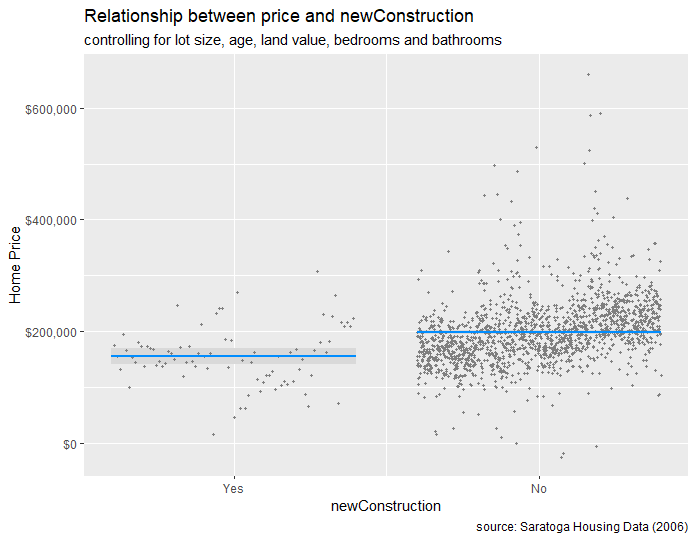

# Causalidad SaratogaHouses

En sste script muestro un analisis de causalidad en el precio de la vivienda en funcion de variables como tamaño del lote, antiguedad de la vivienda, valor del terreno entre otras variables. 
El data set es SaratogaHouses perteneciente al package="mosaicData".
Como es sabido, en economía/econometría se utiliza el método de minimos cuadrados ordinarios para encontrar los parametros poblacionales en un método de regresión lineal. Este método minimiza la suma de las distancias verticales entre las respuestas observadas en la muestra y la respuesta del modelo.

El método MCO, siempre y cuando se cumplan los supuestos clave, será consistente cuando los regresores sean exógenos y no haya perfecta multicolinealidad (situación en la que se presenta una fuerte correlación entre variables explicativas del modelo), este será óptimo en la clase de parámetros lineales cuando los errores sean homocedásticos y además no haya autocorrelación. En el lenguaje comunmente hablado, decimos que los errores deben comportarse ¨bien¨, ser aleatorios, en su defecto estariamos incurriendo en algun tipo de mala especificación del modelo. En estas condiciones, el método de MCO proporciona un estimador insesgado de varianza mínima siempre que los errores tengan varianzas finitas. Bajo la suposición adicional de que los errores se distribuyen normalmente, el estimador MCO es el de máxima verosimilitud. 

